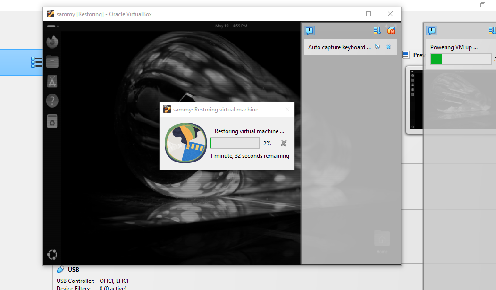
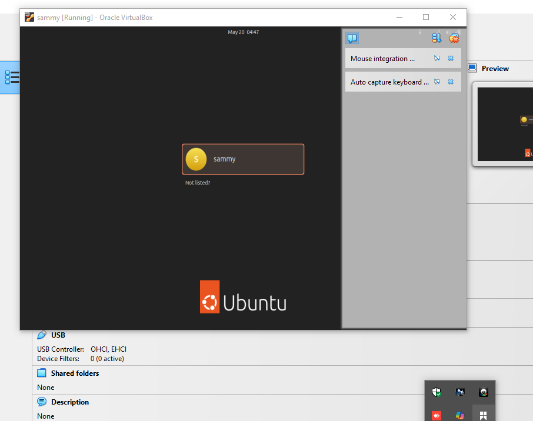
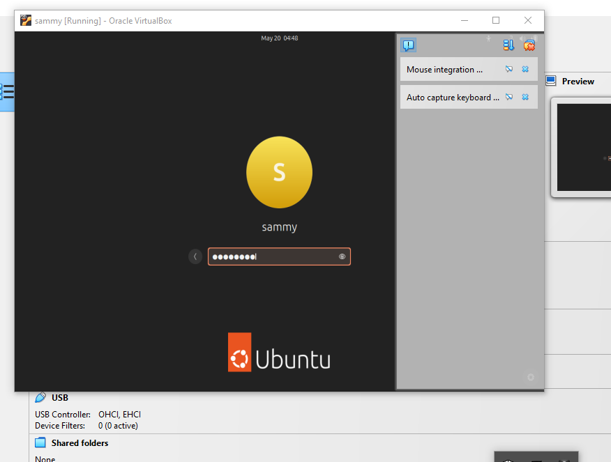
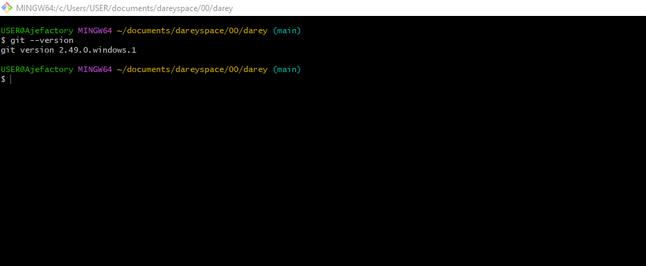
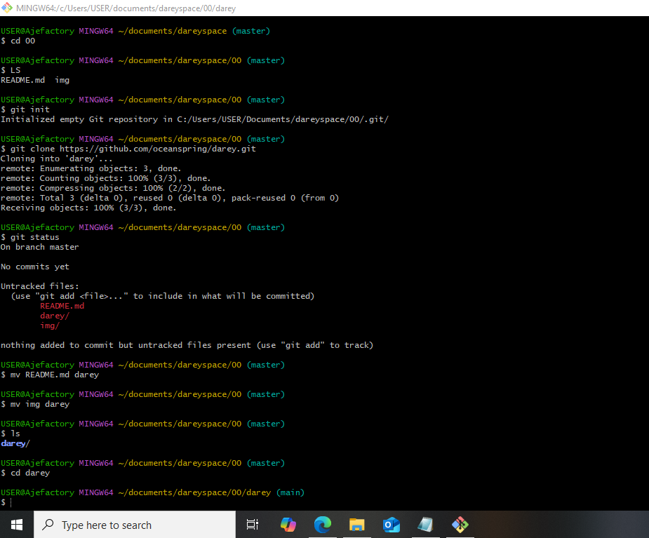
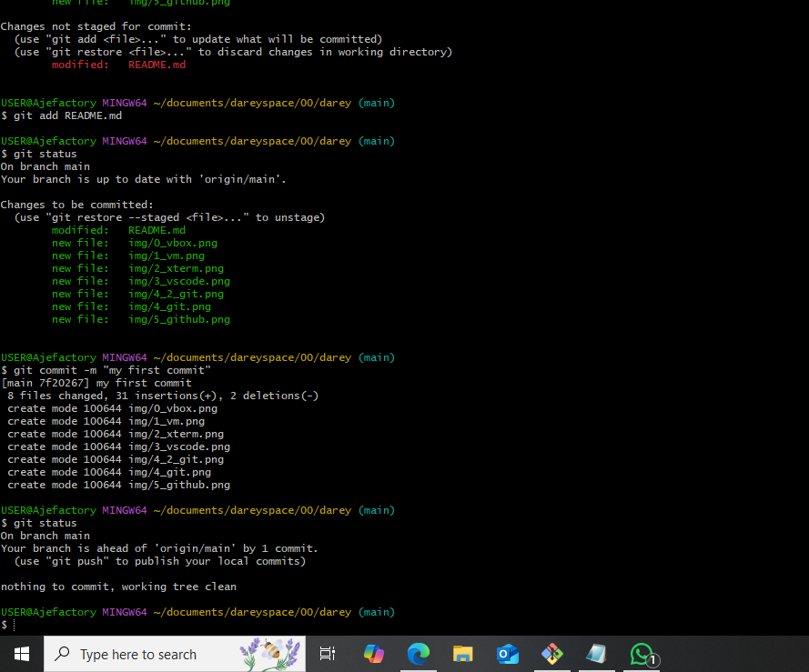

# ENVIRONMENT SETUP DOCUMENTATION 

## THINGS TO DO
- Install Ubuntu Linux on Virtual Box after downloading both 
- Install Mobaxterm 
- Install Visual Studio 
- Create a Github account repository and install Git 
- Create an AWS account and provision storage 

### Applications Screenshots

#### Virtual Box

#### Running Ubuntu Virtual Machine 

##### Starting Up

##### Username 

##### Password

##### Running

#### MobaXterm 

#### Visual Studio 

#### Git 

##### Git Version 

##### Git Operations

#### Github 

#### AWS Account
